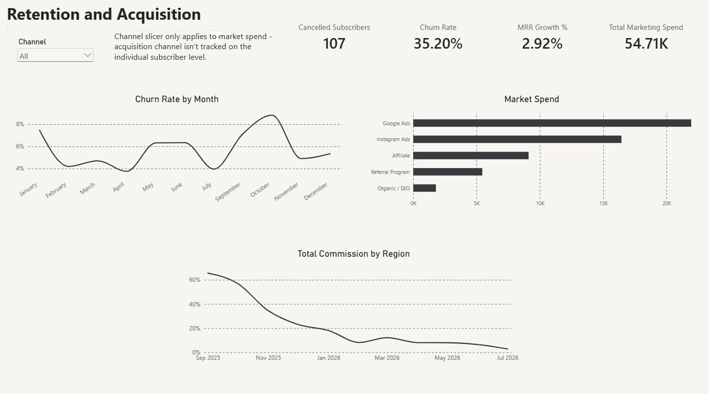

← [Back to Steadfast Business Analytics](../../README.md)

# Subscription Business — Retention and Acquisition Dashboard

## The Business

A subscription business spending real money across multiple acquisition channels — Google Ads, Instagram Ads, affiliate, referral, organic — needed to know whether that spend was actually translating into customers who stuck around, not just new signups.

## What's On It

- **Retention KPIs** — cancelled subscribers, churn rate, MRR (monthly recurring revenue) growth %, and total marketing spend
- **Churn rate by month** — tracking retention health over time, not just a single current snapshot
- **Marketing spend by channel** — Google Ads, Instagram Ads, Affiliate, Referral Program, and Organic/SEO, compared directly
- **Trend tracking** — connecting acquisition activity to what's actually happening with the subscriber base

## The Question It Answers

*Is marketing spend actually producing customers who stay — or just short-term signups that churn out?*

A subscription business can burn significant money acquiring customers who cancel within months. This dashboard puts churn and acquisition spend side by side, so that tradeoff is visible instead of hidden in two separate reports.

## Built With

Power BI, connected directly to the subscription platform and billing data — refreshed automatically, no manual exports.

---

**Want something like this for your own business?** [See plans & pricing](../../README.md#one-plan-add-exactly-what-you-need) · [Get in touch](../../README.md#get-in-touch)
